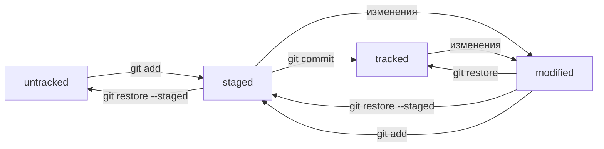

## Памятка по работе с Git
---
### Работа с файловой системой:
1. показать рабочую папку (print working directory)
~~~bash
pwd
~~~ 
2. сменить директорию на домашнюю
~~~bash
cd ~
~~~
3. отобразить содержимое директории
~~~bash
ls
~~~
4. показать все файлы, в том числе скрытые
~~~bash
ls -a
~~~
5. создание файла (%ИМЯ_ФАЙЛА%)
~~~bash
touch 
~~~
6. создать директорию
~~~bash
mkdir 
~~~
7. cp [что_копируем] [куда_копируем] - копирование файлов и директорий (источников "что копируем" может быть несколько). Копирование каталогов необходимо выполнять с флагом -r
~~~bash
cp 
~~~
~~~bash
cp -r 
~~~
8. перемещение файла или папки
~~~bash
mv
~~~
9. чтение и вывод текстового файла
~~~bash
cat 
~~~
10. удаление файла
~~~bash
rm 
~~~
11. удаление пустого каталога
~~~bash
rmdir 
~~~
12. удаление каталога вместе с вложенными файлами
~~~bash
rm -r 
~~~
---
### Инициализация Git:
1. Настройка Git
~~~bash
git config --global user.name "Dmitry"
~~~
~~~bash
git config --global user.email phantom-333@yandex.ru
~~~
2. Посмотреть конфигурацию Git
~~~bash
git config --list
~~~
3. создать репозиторий Git
~~~bash
git init
~~~
4. отключить отслеживание репозитория Git
~~~bash
rm -rf .git 
~~~
5. показать состояние репозитория
~~~bash
git status
~~~

6. подготовить к сохранению все файлы в каталоге
~~~bash
git add .
~~~
7. подготовить к сохранению определенный файл (git add [имя файла])
~~~bash
git add 
~~~
8. выполнить откат (git restore --staged [имя файла]) откат последних изменений из состояния stage->modified, либо откат добавления файла в отслеживаемые (если он впервые был добавлен через git add)
~~~bash
git restore --staged
~~~
9. Сброс отслеживания всей текущей папки:
~~~bash
git restore --staged .
~~~
10. выполнить откат изменений в файле, который еще не был закоммичен (git restore [имя файла]), восстанавливается последнее актуальное состояние (HEAD)
~~~bash
git restore 
~~~
11. выполнить коммит, для которого установить краткую заметку - описание изменений (git commit -m "заметка")
~~~bash
git commit -m ""
~~~
12. внести правки в уже сделанный коммит (параметр no-edit означает, что сообщение остается прежним, если его нужно изменить, то используется флаг -m)
~~~bash
git commit --amend --no-edit
~~~
13. «откатить» коммит (файлы в нем) к более раннему состоянию (git reset --hard [commit hash]), исключенные из коммита файлы удаляются
~~~bash
git reset --hard 
~~~
14. посмотреть историю коммитов
~~~bash
git log
~~~
15. посмотреть историю коммитов в сокращенном виде
~~~bash
git log --oneline
~~~
16. посмотреть отличия в файлах между 2 коммитами (git diff [commit hash1] [commit hash2]). Если вводить команду без параметров [commit hash], то она покажет разницу между модифицированными файлами (еще не закоммиченными) и последним коммитом (HEAD).
~~~bash
git diff 
~~~
17. посмотреть изменения в stagged-файлах (после выполнения команды git add и до выполнения git commit)
~~~bash
git diff --staged
~~~
---
### Настройка списка файлов, которые не будут отслеживаться и добавляться при коммитах:
1. создать в корне репозитория текстового файла .gitignore, в котором будут перечислены игнорируемые файлы
~~~bash
touch .gitignore
~~~
2. добавить в файл .gitignore список неотслеживаемых файлов, можно с помощью следующих масок:
.[имя файла] - игнорируются все файлы с данным именем, включая вложенные каталоги
* - игнорировать файлы с любыми строками (к примеру, *.jpeg - игнорировать все файлы jpeg; docs/*/tmp - игнорировать все папки tmp во всех подпапках docs, если указать **, то каталог tmp будет игнорироваться независимо от количества вложенных каталогов между папкой docs и tmp)
? - соответствует одному любому символу (file?.txt - будут игнорироваться файлы file1.txt, fileA.txt и т.д.; при этом file12.txt проигнорирован не будет, т.к. он не попадает под шаблон с одним ?)
[…]? - игнорируются файлы с одним символом из списка, указанного в квадратных скобках (можно задать диапазон [a-d], или просто перечислить символы [abcd])
/ - слеш в начале указывает на каталоги или корневой каталог (к примеру, "/todo.txt" - игнорировать файл todo.txt в корневом каталоге, а если указать "todo.txt" без слеша, то будут проигнорированы все файлы todo.txt во всех каталогах)
[название каталога]/ - игнорировать каталог с файлами
! - знак инверсии для создания исключений игнорирования из общих правил со "*"
/# - после этого символа идет комментарий, который не учитывается git
3. вывести список игнорируемых файлов
~~~bash
git status --ignored
~~~
---
### Работа с удаленным репозиторием GitHub:
1. вывести список созданных ssh ключей (как правило, в домашнем каталоге)
~~~bash
ls -la .ssh/
~~~
2. генерация SSH ключа ed25519, обычно требуется 1 раз (sh-keygen -t ed25519 -C "электронная почта, к которой привязан ваш аккаунт на GitHub")
~~~bash
ssh-keygen -t ed25519 -C ""
~~~
3. вместо алгоритма ed25519 при создании SSH ключа можно использовать RSA (ssh-keygen -t rsa -b 4096 -C "электронная почта, к которой привязан ваш аккаунт на GitHub")
~~~bash
ssh-keygen -t rsa -b 4096 -C ""
~~~
4. скопировать публичный ключ ed25519 в буфер обмена для последующей вставки в GitHub
~~~bash
clip < ~/.ssh/id_ed25519.pub
~~~
5. проверка корректности настройки SSH
~~~bash
ssh -T git@github.com
~~~
6. привязать удаленный репозиторий к локальному, выполняется в каталоге проекта (git remote add origin "адрес репозитория GitHub" - адрес репозитория берется с GitHub)
~~~bash
git remote add origin ""
~~~
7. проверить, что локальный и удаленный репозиторий связаны
~~~bash
git remote -v
~~~
8. отправить изменения на удаленный репозиторий, в первый раз с флагом -u origin master, вместо master может быть main. В последующие разы достаточно использшовать только "git push"
~~~bash
git push -u origin master
~~~
~~~bash
git push -u origin main
~~~
~~~bash
git push
~~~
9. клонировать репозиторий с GitHub в локальный Git (git clone <ссылка на репозиторий> <название папки>)
~~~bash
git clone
~~~
10. изменить URL удаленного репозитория
~~~bash
git remote set-url origin 
~~~